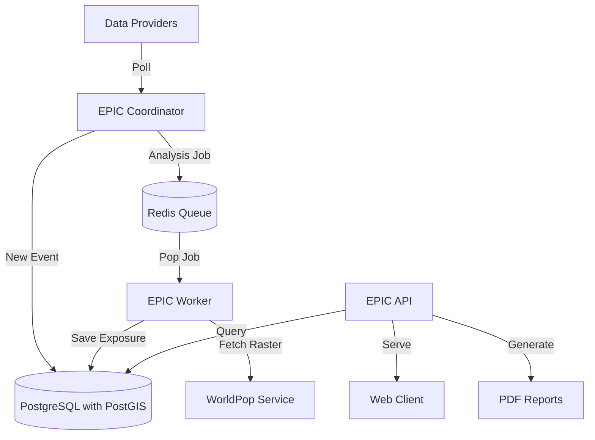

**Background:** Initial hazard impact estimations involve the successive calculation of people exposed, people impacted and people in need. These figures are continuously updated as events unfold, and disaggregations by admin levels are performed. While people impacted and PiN figures rely on initial assessments by local actors, people exposed can potentially be computed ahead of time, using hazard geometry sources and open population rasters. EPIC aims to automate this process; instantly outputting comprehensive exposure estimation products for every current active hazard.

![[image.png|EPIC providing population exposure estimates for TC DITWAH]]
## Overview
In technical terms, EPIC is a high-performance, Rust-based microservices platform designed to automatically detect natural hazard events (earthquakes, cyclones, floods), analyze their potential impact on human populations using high-resolution geospatial data, and disseminate the results via APIs and reports.

Due to the need to process large amounts of data in real-time, a high-efficiency stack was developed using the [Rust](https://rust-lang.org/) programming language:

## Features
- **Multi-Hazard Support**: Native handling of Earthquakes (USGS) and generic hazards (GDACS - Floods, Cyclones).
- **Real-time Analysis**: Automated pipeline triggers analysis seconds after an event is detected.
- **High-Resolution Data**: Uses 1km and 100m WorldPop raster data for precise population exposure estimation.
- **GraphQL API**: Flexible query interface for frontend applications.
- **Map Tile Server**: Built-in dynamic tiling for rendering massive geospatial datasets on web maps.
- **Report Generation**: Automated generation of PDF Situation Reports.
- **Resilient Architecture**: Decoupled ingestion and analysis via Redis queues; Dockerized for easy deployment.
## Core components
The core [repository](github.com/OCHA-HPCS/epic) is organized in multiple packages (or "crates" in Rust terms):
- `epic_coordinator`: the ingestion service. It periodically polls external data providers ([USGS](https://www.usgs.gov/), [GDACS](https://www.gdacs.org/), [ReliefWeb](https://reliefweb.int/)) to detect new or updated hazard events. It persists events to the database and pushes analysis jobs to the queue.
- `epic_worker`: the analytical engine. It consumes jobs from [Redis](https://redis.io/), downloads necessary hazard geometries (Shakemaps) and population rasters ([WorldPop](https://www.worldpop.org/)), performs high-performance geospatial overlay analysis, and calculates impact statistics.
- `epic_api`: a GraphQL API ([Axum](https://docs.rs/axum/latest/axum/) + [Async-GraphQL](https://docs.rs/async-graphql/latest/async_graphql/)) that serves event data, exposure details, and generates PDF reports. It also acts as a high-performance XYZ map tile server for visualizing hazard zones and population density.
- `epic_core`: the shared library containing domain models, database traits, and common geospatial utilities.
- `epic_cli`: a command line interface tool used to run analyses manually for testing.
- `epic_provider_*`: modular adapters for external APIs (USGS Earthquake Hazards, GDACS).
- `epic_publisher`: a library dedicated to typesetting and generating PDF situation reports using [Typst](https://typst.app/).
## Getting started
Documentation is included in the repository's `README.md` file (see [here](https://github.com/OCHA-HPCS/epic)).

The [React](https://react.dev/) frontend is published in its [own repository](https://github.com/OCHA-HPCS/epic-frontend) and should be run alongside the API service for operation.

> [!INFO] Much like the [[HPCS Cluster]], maintaining EPIC necessitate sustained involvement from a dedicated software engineering team. The platform isn't currently designed to run unsupervised and requires constant tweaks and improvements.
## Future directions
EPIC's modular architecture enables integrations with any partners exposing API services. Moreover, EPIC's own GraphQL API can be used to feed information into other systems such as [[RAG Development|OCHA RAG]] or the new Fabric datastore.

At one point, real-time partner collaboration features were considered (sharing products, requesting support, etc...), though synergies with existing platforms such as VOSSOC should be considered first to encourage adoption.